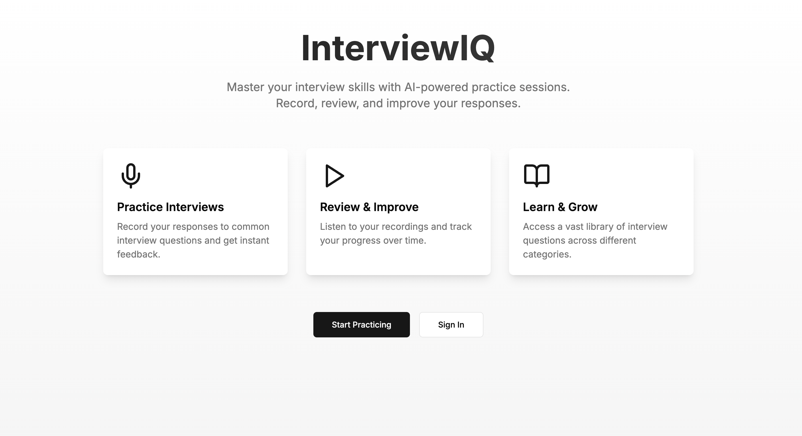
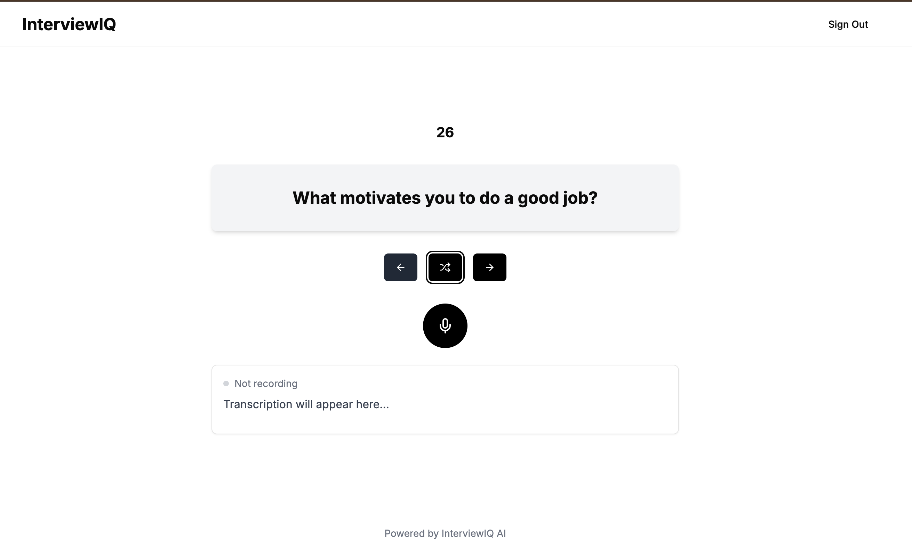

# InterviewIQ

InterviewIQ is an AI-powered interview preparation platform designed to simulate real-world interviews and provide actionable feedback to enhance your skills. It focuses on helping users build confidence, improve communication, and ace their next job interview.

## Features

- **Dynamic Question Generation**: Tailored questions based on the selected job role and expertise level.
- **AI Feedback System**: Provides real-time feedback on answers, including tone, clarity, and content.
- **Audio-Only Simulations**: Realistic audio-only interview simulations to replicate remote interview environments.
- **Customizable Interview Settings**: Adjust interview duration, question difficulty, and evaluation focus.
- **Performance Reports**: Detailed analytics of strengths and improvement areas after each session.
- **Secure Data Handling**: User data is stored securely to ensure privacy.

## Technologies Used

- **Frontend**: React, Tailwind CSS
- **Backend**: Node.js
- **AI Engine**: OpenAI API for natural language processing and evaluation
- **Database**: MongoDB
- **Hosting**: Vercel

## Installation

Follow these steps to set up InterviewIQ locally:

### Prerequisites

- Node.js and npm installed
- OpenAI API Key

### Clone the Repository
```bash
git clone https://github.com/tarun05rawat/InterviewIQ.git
cd InterviewIQ
```

### Install Dependencies
```bash
npm install
```

### Set Up Environment Variables

Create a `.env.local` file in the root directory and add the following:

```env
NEXT_PUBLIC_OPENAI_API_KEY=your_openai_api_key
NEXT_PUBLIC_DATABASE_URL=your_mongodb_connection_string
```

Replace the placeholder values with your OpenAI API Key and MongoDB connection string.

### Start the Development Server
```bash
npm run dev
```

The application will be available at `http://localhost:3000`.

## Deployment

To deploy the application, use [Vercel](https://vercel.com/). Add the same environment variables in the Vercel dashboard under **Settings > Environment Variables**.

## Usage

1. **Select Interview Settings**:
   - Choose a job role, expertise level, and interview duration.

2. **Start the Interview**:
   - Begin an audio-only interview session, answering AI-generated questions.

3. **Receive Feedback**:
   - Get real-time AI feedback on your performance.

4. **Analyze Your Performance**:
   - Review a detailed report with actionable feedback and analytics.

## Folder Structure

```
/@components
  /ui           # Reusable UI components (e.g., Button, Card)
  /_components  # Page-specific components
/app
  /routes       # Route-specific logic
/config         # Configuration files (e.g., OpenAI and Database settings)
/lib            # Utility functions
/public         # Static assets
```

## Screenshots

  


  


## Contributions

Contributions are welcome! If you’d like to contribute to this project:

1. Fork the repository.
2. Create a new branch (`git checkout -b feature-name`).
3. Commit your changes (`git commit -m "Add a new feature"`).
4. Push to your branch (`git push origin feature-name`).
5. Open a pull request.

## License

This project is licensed under the MIT License. See the [LICENSE](LICENSE) file for more details.
